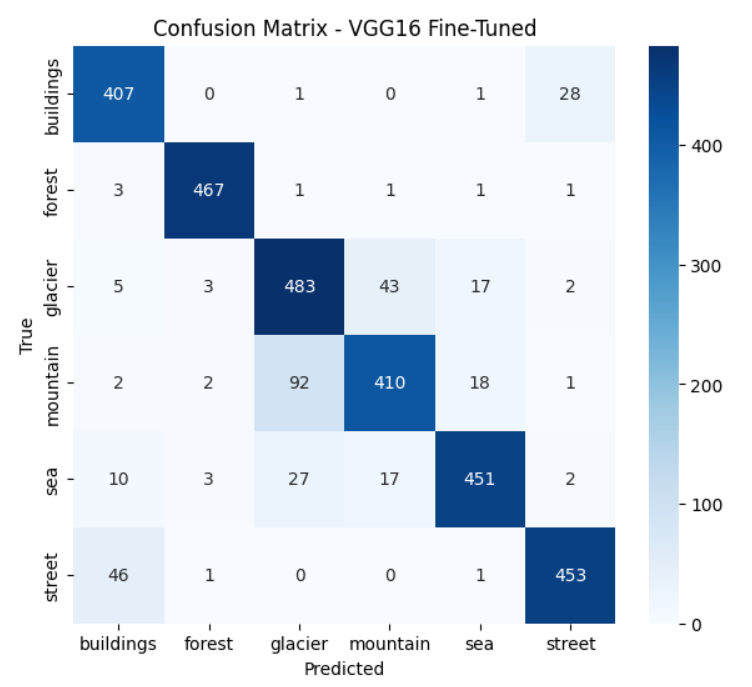
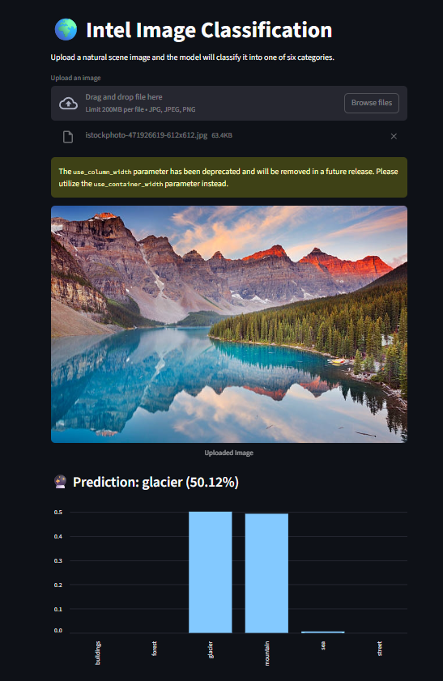

# 🖼️ Intel Image Classification with CNNs & Transfer Learning


> 🧠 A complete end-to-end deep-learning pipeline — from data preprocessing and CNN training to a deployment-ready Streamlit app.

---

## 📌 Project Overview

This project focuses on **scene image classification** using Convolutional Neural Networks (CNNs) and Transfer Learning.  
The dataset consists of natural scenes categorized into six classes, and the goal was to develop a high-accuracy model deployable via Streamlit.

**Highlights**
- 🧩 Baseline CNN from scratch (80 % accuracy)  
- ⚙️ Transfer learning with **VGG16** (88 %)  
- 🎯 Fine-tuned model reaching **90 %+ validation accuracy**  
- 📈 Visualizations: confusion matrix and Grad-CAM interpretability  
- 🖥️ Frontend built in **Streamlit**

---

## 📂 Dataset

- **Source:** [Intel Image Classification Dataset – Kaggle](https://www.kaggle.com/puneet6060/intel-image-classification)
- **Classes:** `buildings`, `forest`, `glacier`, `mountain`, `sea`, `street`
- **Split:**
  - Train ≈ 14 000  
  - Validation ≈ 3 000  
  - Test ≈ 3 000  

---

## 🧱 Architecture & Approach

### Data preparation
- Verified and removed corrupted images  
- Applied extensive augmentation (`rotation`, `shift`, `zoom`, `brightness`, `flip`)  
- Normalized pixels to [0, 1]

### Baseline CNN
- 3 convolutional + pooling layers  
- Dense layer (256 neurons + dropout)  
- Accuracy ≈ 80 % @ 10 epochs  

### Transfer Learning – VGG16
- Pre-trained ImageNet base  
- Custom head: `Flatten → Dense(512 ReLU) → Dropout → Softmax(6)`  
- Validation ≈ 88 %

### Fine-tuned Model
- Unfrozen last block (`block5_conv1–3`)  
- LR = 1e-5, early stopping  
- Validation ≈ 90.4 %, Test ≈ 90.2 %

### Hyperparameter Optimization
- Tuned with **Keras Tuner**: conv blocks, filters, dense units, dropout, optimizer, LR  

---

## 📊 Results

| Model | Validation Acc | Test Acc |
|:------|:---------------:|:--------:|
| Baseline CNN | 80 % | 78.5 % |
| VGG16 (frozen) | 88.4 % | 87.5 % |
| **VGG16 (fine-tuned)** | **90.4 %** | **90.2 %** |

**Classification Report**

```
              precision    recall  f1-score   support
   buildings      0.91     0.87     0.89       437
      forest      0.97     0.99     0.98       474
     glacier      0.87     0.85     0.86       553
    mountain      0.86     0.84     0.85       525
         sea      0.92     0.92     0.92       510
      street      0.89     0.94     0.92       501
    accuracy                          0.90      3000
```

---

## 📸 Visualizations

| Confusion Matrix |
|:-----------------|
|  |

**Streamlit App Demo**



---

## 🧩 Tech Stack
- **Languages:** Python (Numpy, Pandas)  
- **Frameworks:** TensorFlow 2.14 · Keras 3.3.3 · Streamlit  
- **Visualization:** Matplotlib · Seaborn · OpenCV  
- **Tools:** Jupyter Notebook · Keras Tuner · Git  

---

## 🚀 Deployment & MLOps


### Deployment Options
- Dockerized App  
  ```bash
  docker build -t intel-cnn-api .
  docker run -p 8501:8501 intel-cnn-api
  ```
- Deploy on AWS · GCP · Render · Streamlit Cloud  
- Production server → NGINX + Gunicorn  

### MLOps Extensions
- CI/CD pipeline (GitHub Actions)  
- Model registry (MLflow / Weights & Biases)  
- Drift monitoring & auto-rollback  

---

## 🎨 Streamlit App

**Run locally**

```bash
streamlit run app/app.py
```

**Features**
- Upload JPG/PNG image  
- Displays prediction + confidence chart  
- Clean and responsive UI  

---

## ⚙️ Setup Guide

```bash
# 1️⃣ Clone repo
git clone https://github.com/parthhpatel/intel-image-classification.git
cd intel-image-classification

# 2️⃣ Create virtual environment
python -m venv venv
.env\Scriptsctivate

# 3️⃣ Install requirements
pip install -r requirements.txt

# 4️⃣ Run app or notebook
streamlit run app/app.py
# or
jupyter notebook notebooks/Intel_Image_Classification.ipynb
```

---

## 🗂️ Folder Structure

```
intel-image-classification/
├── notebooks/
│   └── Intel_Image_Classification.ipynb
├── app/
│   ├── app.py
│   └── intel_cnn_best.h5
├── results/
│   ├── confusion_matrix.png   
│   └── streamlit_demo.png
├── requirements.txt
├── README.md
├── .gitignore
└── LICENSE
```

---

## 🧠 Key Learnings
- Built CNN & transfer-learning pipelines  
- Fine-tuned pre-trained architectures  
- Hyperparameter tuning with Keras Tuner  
- Grad-CAM model interpretability  
- Streamlit deployment and MLOps readiness  

---

## 🧾 License
Released under the **MIT License**.  
See the [LICENSE](LICENSE) file for details.

---

## 👤 Author

**Parth Patel**  
📧 [parthhpatel2504@gmail.com](mailto:parthhpatel2504@gmail.com)  
🔗 [LinkedIn](https://www.linkedin.com/in/parth-patel-8990a9281/) · [GitHub](https://github.com/parth147op)

---

> 🚀 From data to deployment — making deep learning models interpretable, performant and production-ready.
